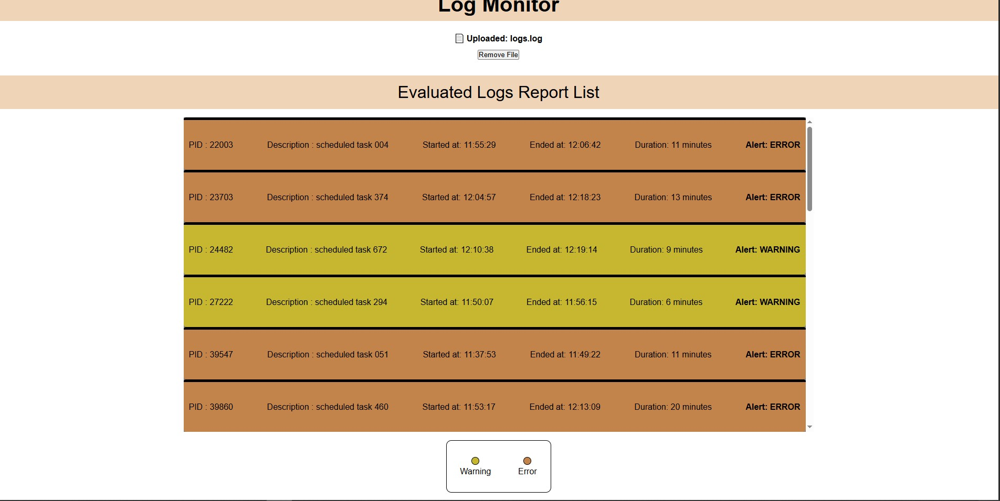

# 🧾 Log Monitoring Application - LSEG Assignment

## 📸 Application Preview




A frontend application built with **React + TypeScript** to parse `.log` files, evaluate task durations, and flag long-running jobs with **warnings or errors**. This app mimics internal developer tooling and focuses on clear UX, performance, and clean code.

---

## 📌 Features

- 🔍 **File upload** for `.log` or  files in a structured format.
- 🧠 **Parsing and evaluation** of each job based on PID and duration.
- ⚠️ Categorization of jobs into:
  - `"WARNING"` — if between 5–10 minutes.
  - `"ERROR"` — if longer than 10 minutes or incomplete.
- 🪟 **Virtualized list** rendering for performance (even with large files).
- 🎨 **Color-coded UI** to visually separate WARNING/ERROR tasks.
- 🧪 **Test coverage** for parsing logic and rendering behavior (basic unit test suite included).

---

## 📂 Log File Format

Expected format:  
Each line must follow this structure:

HH:MM:SS,description,status,PID

Example:

11:35:23,scheduled task 032,START,37980
11:35:56,scheduled task 032,END,37980

## 🚀 Getting Started

### 1. Clone the repo

```bash
git clone https://github.com/aniket30i/lseg-log-monitor.git
cd lseg-log-monitor

npm install

npm run dev
```

### 🚀 Running the Tests

```
For testing to work - 
create :
src/tests/setupTests.ts

// setupTests.ts

import '@testing-library/jest-dom';

// vite.config.ts
import { defineConfig } from 'vite';
import react from '@vitejs/plugin-react';

export default defineConfig({
  plugins: [react()],
  test: {
    globals: true,
    environment: 'jsdom',
    setupFiles: './src/setupTests.ts',
  },
});

npm run test
```
## ✅ Unit Tests Overview

This project includes unit tests for both utility functions and UI components, written using **Vitest** and **React Testing Library**.

---

### 📄 `parseLogLine.test.ts`

This test suite verifies the correctness of the `parseLogLine` utility function, which parses a single log entry string into a structured object.

#### ✅ Test Cases:

| Test Description                          | Expected Behavior                                                                 |
|-------------------------------------------|------------------------------------------------------------------------------------|
| Parses a valid log line correctly         | Returns a structured object with `time`, `desc`, `status`, and `pid`              |
| Returns null for invalid log line format  | Ensures malformed log strings are safely discarded without throwing errors        |

---

### 🧩 `EvaluatedList.test.tsx`

This suite tests the `EvaluatedList` component, which displays categorized log entries filtered by status.

#### ✅ Test Cases:

| Test Description                          | Expected Behavior                                                                 |
|-------------------------------------------|------------------------------------------------------------------------------------|
| Filters out logs with status "OK"         | Only logs with "WARNING" or "ERROR" should be rendered                            |
| Renders "WARNING" and "ERROR" logs        | Tasks with these statuses appear in the DOM with correct descriptions             |
| Displays correct formatted durations      | Duration is rendered in minutes (e.g., "6 minutes", "12 minutes")                 |
| Renders PID and Description               | Validates presence of task metadata (`PID`, `desc`) in the rendered output        |
| Shows correct Alert labels                | Confirms the right status label ("Alert: WARNING", "Alert: ERROR") is shown       |

#### 🔧 Notes:

- `beforeEach()` resets the DOM to ensure tests do not bleed into each other.
- JSX rendering is tested using `@testing-library/react`'s `render` and `screen`.

---


##Tech Stack

-React 19

-TypeScript

-Vite

-Zod for input validation

-vitest + React Testing Library (for tests)

-Vanilla CSS (for styling)

## 📝 Notes

- ⏳ **Categorization is delayed intentionally** to simulate real-time evaluation (visible via a loader).
- 🪟 **UI remains minimal but intuitive** for log visibility and issue tracking.
- A filter for OK / ERROR / WARNING would have been a good additon

# Documentation 

##Components

/**
 * Monitor Component
 * 
 * Handles file upload, parsing log contents, and categorizing tasks based on execution time.
 * Renders the evaluated log list or a loader while processing.
 */

/**
 * EvaluatedList Component
 * 
 * Displays a virtualized list of tasks that are either in WARNING or ERROR status.
 * Implements scroll-based rendering to optimize performance for large logs.
 * Each item is color-coded based on its status.
 * 
 * Props:
 * - finalList: GroupedTask[] — The array of categorized task logs
 */

/**
 * Legend Component
 * 
 * Displays the meaning of each color code used in the evaluated list.
 * Useful for interpreting WARNING, ERROR, and OK status colors.
 */

## Utility functions

/**
 * Parses a single line from the log file into a structured LogLine object.
 * 
 * @param line - A string log entry in the format "HH:MM:SS, description, status, pid"
 * @returns LogLine object if valid, otherwise null
 */
export function parseLogLine(line: string): LogLine | null

/**
 * Groups log entries by PID and evaluates their start/end timestamps to calculate duration.
 * 
 * Determines the status of each job:
 * - "OK" if duration ≤ 5 minutes
 * - "WARNING" if > 5 and ≤ 10 minutes
 * - "ERROR" if > 10 minutes or missing start/end
 * 
 * @param logs - Array of parsed LogLine entries
 * @returns Array of GroupedTask objects with categorized status and metadata
 */
export function groupLogsByPid(logs: LogLine[]): GroupedTask[]

/**
 * Formats a JavaScript Date object to "HH:MM:SS" format.
 * 
 * @param date - Date object
 * @returns Formatted time string
 */
export function formatTime(date: Date): string

## Custom Types

```

export type LogLine = {
  time: string;
  desc: string;
  status: "START" | "END";
  pid: string;
};

export type GroupedTask = {
  pid: string;
  desc: string;
  duration: number;
  start: Date;
  end: Date;
  status: TaskStatus;
};

```


